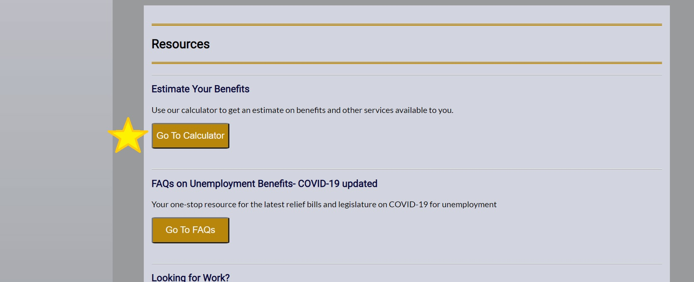

# Redesign of the Kentucky Unemployment Portal
This is a reimaged page for the Kentucky Unemployment Portal for my capstone project in Code Louisville: Front-End Web Development class, Spring 2021.

* Demo page here: https://eleanor-shellstrop.github.io/ky-unemploy-redo/

## Summary
Like so many across the country, I was furloughed during the COVID-19 pandemic. Navigating the Kentucky Unemployment Portal page has been a source of frustration for me. In this project, I created a page that has the feel of a government website while keeping mobile-first design and user ease a priority. 

This page is only to demostrate skills with HTML, CSS and JavaScript. It is in no way to be used for unemployment services of any kind. This project does not include back-end development code or features. 

## Key Features

CSS Features:
* Navigation menu that opens up from vertical to horizontal on 700px larger screens.
* Photo content above "Contact Us" section changes at 800px or larger screens.
* Flexbox layout switches to grid with a new sidebar at 1200px or larger screens.
* Video at the top of the page that autoplays, has controls, and is muted upon opening the website.

JS Features:
* Scroll to "Estimate Your Benefits" and click "Go To Calculator." 
  
* Entering a salary will calculate estimated benefits and additional resources available by income bracket using nested objects: 
```javascript
let tierLevel = {
    tierOne: {
        eligiblePercentage: 1.00,
        minSalary: 1500,
        maxSalary: 29999,
        otherHelp: ['Food and grocery assistance', 'Tuition and grants', 'Childcare assistance']
    },
    tierTwo: {
        eligiblePercentage: 0.80,
        minSalary: 30000,
        maxSalary: 74999,
        otherHelp: ['Food and grocery assistance']
    },
    tierThree: {
        eligiblePercentage: 0.75,
        minSalary: 75000,
        maxSalary: 99999,
        otherHelp: ['None']
    },
    tierFour: {
        eligiblePercentage: 0.70,
        minSalary: 100000,
        maxSalary: 150000,
        otherHelp: ['None']
    }
}
```
   * Salaries above $150,000 and below $1,500 are not eligible.
   * User must click "Submit" button to run calculator. Results appear below.
* Navigation Features:
  * The "Submit" button on the log in page takes the user to the homepage.
  * The calculator page opens from the "Go To Calculator" button.
  * The "Back To Home" button on the calculator page takes the user back to the homepage.

# Media Credits:
* Kentucky COVID-19 seal credits: Concepts by Jason and Brooke Ison and @tizbitz, design by @SinclairArt for https://www.KyforKy.com
* All other images and video designed by Anne Ensign using https://www.Canva.com